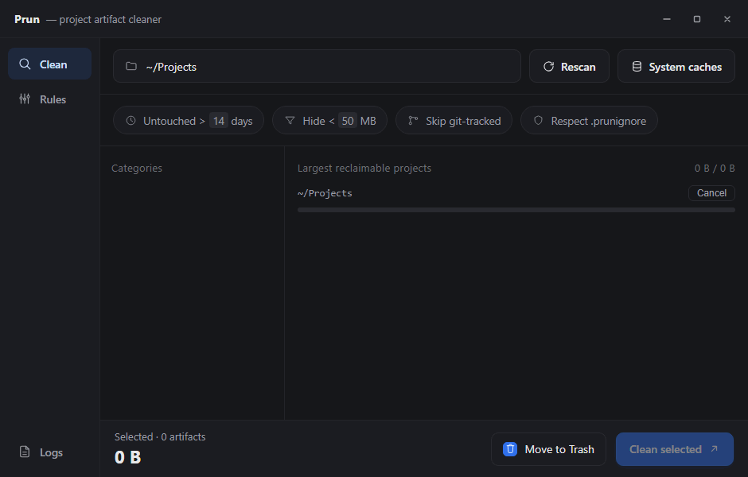

# Prun — project artifact cleaner

Prun finds the disposable, regeneratable junk scattered across your projects
— `node_modules`, `target`, `.venv`, `vendor`, build caches, and more — and
lets you reclaim the space. It's a small, fast Tauri v2 desktop app (plus a
headless CLI for scripting) with a rule-based detector covering ~26
ecosystems out of the box.



[Explore the live browser demo](https://devlooper8.github.io/prun/demo/) — it uses sample data and never accesses your files.

## Why

Every project you've ever built leaves artifacts behind: a `node_modules`
here, a `target/` there, a Python `.venv` you forgot about, a Gradle cache
that's quietly grown to gigabytes. None of it is precious — it all
regenerates on the next build — but it piles up silently across dozens of
project folders until a disk fills up. Prun scans a projects root (or your
per-user system caches), groups what it finds by project, and gets out of
your way for the actual decision: Trash it (recoverable, the default) or
delete it for good.

## Features

- **Fast, parallel scanning** with live progress, over a directory tree of
  many projects or your per-user system caches (Cargo registry, npm, Gradle, …).
- **Rule-based detection** across ~26 ecosystems (Rust, Node.js, Python, JVM,
  Go, .NET, PHP, Ruby, C/C++, and more) driven by a plain TOML ruleset — see
  [How detection works](#how-detection-works).
- **Results grouped by project**, not a flat list — expandable rows, a
  category sidebar that acts as a filter (not a bulk-selector), and
  age / git-tracked / `.prunignore` / min-size filters.
- **A live selected-of-available size readout** above the list, so the
  running total is never ambiguous about what it's a fraction of.
- **Per-artifact last-modified timestamps**, so you know how stale something
  is before you delete it.
- **Trash by default.** Bypassing Trash for a permanent delete arms the
  button for one confirming second click instead of firing immediately — a
  single misclick can never skip Trash.
- **Drag-and-drop scanning** — drop a folder on the window to scan it — plus
  a remembered list of recently-scanned roots.
- **Honest reporting**: a "moved to Trash" summary reads differently from a
  permanent delete, because Trash doesn't actually free disk space until
  it's emptied.
- **A full in-app rules editor** — add, edit, or disable detection rules
  without hand-editing TOML. Edits are layered *on top of* the built-in
  ruleset, so future updates to it still reach you.
- **A headless CLI** over the same core, for scripting or a cron job that
  reclaims CI cache space — see [Command-line use](#command-line-use).
- **Cross-platform**: Windows, macOS, Linux.

## Install / run

Prereqs: Node 18+, the Rust toolchain, and the
[Tauri system dependencies](https://tauri.app/start/prerequisites/) for your
platform (on Linux: `webkit2gtk-4.1`, `libsoup-3`, plus the usual
`base-devel`).

There's no published binary yet — build it from source:

```bash
npm install
npm run tauri dev      # hot-reloading dev build
npm run tauri build    # bundled release binary + installer
```

Generate icons once if you swap the source icon before a `build`:

```bash
npm run tauri icon path/to/1024.png
```

You can also preview the UI in a plain browser — `npm run dev`, then open
the printed Vite URL. Without the Tauri shell it falls back to sample data
(no real scanning), so layout and interactions stay explorable.

## Command-line use

The same scan/clean/rules core is exposed as a headless CLI. Any subcommand
runs the CLI; with no arguments the desktop app launches instead.

```
prun scan [PATH] [--all] [--min-age DAYS] [--json]
                     list reclaimable build artifacts under PATH (default: .)
                     --all      include git-tracked dirs (default: ignored only)
                     --min-age  only dirs untouched for >= DAYS
prun caches [--json] list per-user system caches (Cargo, npm, Gradle, …)
prun rules  [--json] show the active ruleset status
prun clean [PATH...] move PATHs to the Trash (recoverable)
                     --scan ROOT  clean what a scan of ROOT finds (needs --yes)
                     --min-age N  with --scan: only dirs untouched >= N days
                     --all        with --scan: include git-tracked dirs too
                     --delete     remove permanently instead of trashing
                     --dry-run    print what would be removed, delete nothing
                     --yes        confirm a --scan clean (else it's a dry run)
prun logs            print the log / crash-report directory
```

`clean` takes targets two ways: explicit paths (taken at face value, no
confirmation needed — you named them) or `--scan ROOT` to clean whatever a
scan turns up, which defaults to a dry run unless you also pass `--yes` — so
a cron job can default to "print what it would do" until you're ready:

```bash
# preview what a scan would find, touching nothing
prun scan ~/Projects --min-age 30

# same, framed as a clean dry-run
prun clean --scan ~/Projects --min-age 30

# actually do it — Trash by default
prun clean --scan ~/Projects --min-age 30 --yes

# ...or permanently, e.g. from a CI cache-cleanup job
prun clean --scan ~/Projects --min-age 30 --yes --delete
```

(During development: `cargo run --manifest-path src-tauri/Cargo.toml -- scan ~/Projects`.
On Windows *release* builds the binary is GUI-subsystem, so CLI output won't
attach to a console there — use a dev build for piped output.)

## How detection works

Detection rules live in a plain TOML file (`src-tauri/prun-rules.toml`,
embedded in the binary — see its own header comments for the full model).
The short version:

- A directory is a **project root** for a rule if it contains one of that
  rule's marker files (`Cargo.toml`, `package.json`, `build.gradle*`, …).
- At that root, the rule's `dirs` (exact names) and `globs` become reclaim
  candidates, grouped under an **ecosystem** shown in the sidebar. Anything
  not in the curated ecosystem list still gets a stable, distinct color.
- Marker-less **junk** entries match cross-cutting cruft (OS files, editor
  swap files, code-index databases) in every directory, not just project
  roots.
- Every candidate is still subject to the git-tracked guard, the age gate,
  and an optional `.prunignore`.

Don't like a default? Use the **Rules** tab in the app to add, edit, or
disable rules without touching TOML by hand. Your edits save as a small
override layered on top of the built-in ruleset (not a full replacement), so
a future built-in rule update still reaches you even after customizing.

### Filter semantics

- **Untouched > N days** — drops dirs whose newest file is more recent than
  the cutoff. Applied live in the UI (no rescan needed); also enforced
  backend-side when `--min-age` is set on the CLI.
- **Skip git-tracked** — keeps only directories git *ignores*. If a build
  dir isn't ignored it may be intentionally tracked, so it's left alone —
  the safe reading of the toggle.
- **Respect .prunignore** — if a `.prunignore` (gitignore syntax) exists at
  the root, matching paths are excluded from results.
- **Hide < N MB** — a client-side size floor so the list can focus on the
  big wins.

### Cleaning

`clean(paths, to_trash)` either moves each path to the system Trash (`trash`
crate, recoverable — the default) or `remove_dir_all`s it permanently when
"Move to Trash" is unticked. In the GUI, choosing a permanent delete arms
the Clean button for a second, confirming click instead of firing right away.

## Development

```bash
cargo test --manifest-path src-tauri/Cargo.toml   # backend unit tests
npm test                                          # frontend (Vitest)
npm run build                                     # tsc --noEmit + vite build
npm run lint && npm run format:check              # eslint + prettier
cargo clippy --manifest-path src-tauri/Cargo.toml --all-targets -- -D warnings
```

CI (`.github/workflows/ci.yml`) runs all of the above on Linux, Windows, and
macOS, plus `cargo fmt --check`, a Vitest coverage report, and an advisory
`npm`/`cargo audit`.

### Stack

- **Frontend** — vanilla TypeScript + Vite, no framework. `src/main.ts` for
  the UI; pure logic split into `src/format.ts` / `src/grouping.ts`
  (unit-tested with Vitest), plus `src/rules-editor.ts` and `src/styles.css`.
- **Backend** — Rust (`src-tauri/`), a real disk scanner split into focused
  modules (`scan/`, `clean`, `rules/`, `fs_util`, `commands`, `cli`). See
  [ARCHITECTURE.md](ARCHITECTURE.md) for the module map and the invariants
  the code depends on.

### Notes / tradeoffs

- `age_secs` uses the newest mtime found while sizing the tree (one walk),
  so "untouched for N days" reflects the most recent file change rather
  than the top directory's often-stale mtime.
- Sizing runs in parallel across locations (`rayon`); each tree is measured
  in a single walk that also yields the newest mtime and a count of
  unreadable entries. Reported sizes are *apparent* (sum of file lengths,
  hard links counted once on Unix), not on-disk allocation — close enough
  for "how much will I get back".
- `git2` is pulled with `default-features = false`; it'll vendor libgit2. If
  you'd rather link the system libgit2, enable the `vendored-libgit2`
  feature accordingly.

## More docs

- [ARCHITECTURE.md](ARCHITECTURE.md) — module map, data flow, invariants.
- [CONTRIBUTING.md](CONTRIBUTING.md) — dev setup and the PR bar.
- [SECURITY.md](SECURITY.md) — supported versions, how to report a
  vulnerability privately.
- [CHANGELOG.md](CHANGELOG.md) — release history (Keep a Changelog format).
- [RELEASING.md](RELEASING.md) — cutting a release, code signing,
  auto-updates.

## License

[Apache License 2.0](LICENSE) © 2026 Tomáš Ondruš.
